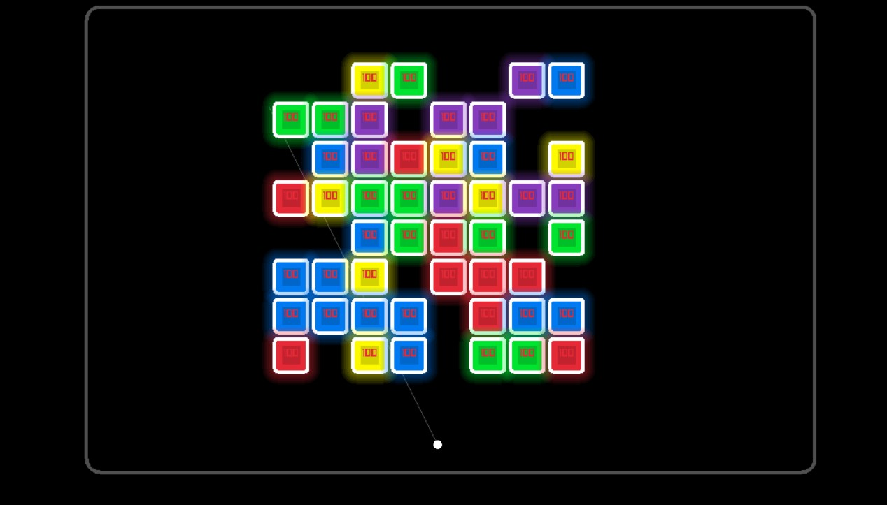
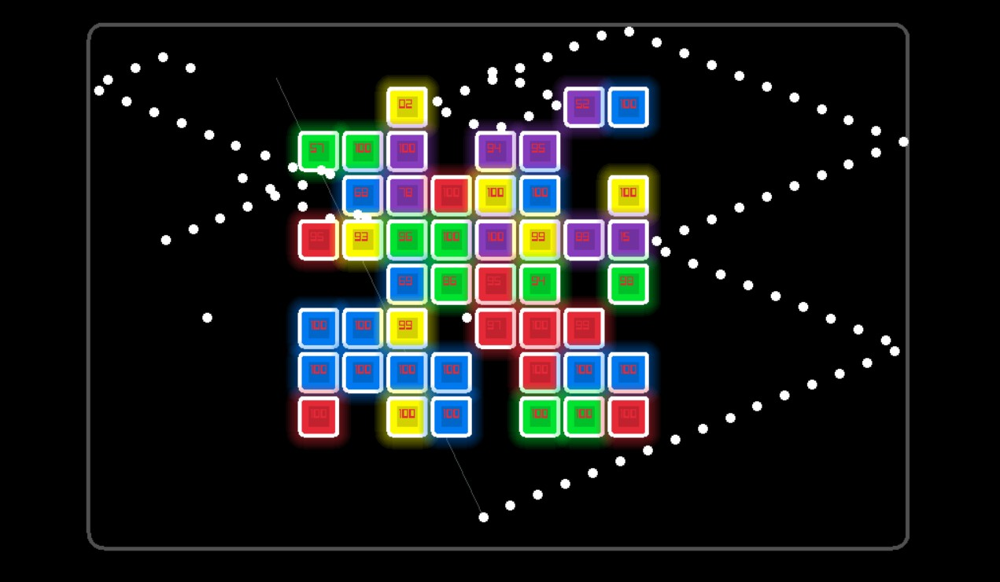

# Bricks 🎮

A simple **brick breaker / multi-ball shooter** game written in **C++** with [raylib](https://www.raylib.com/).  
You launch multiple balls toward bricks; they bounce around and return to the start before you can fire again.  
Your goal is to clear all the bricks on the board!

---
Play the game on your browser here! [Game](https://ramezessam.github.io/Bricks/)

---

## 📸 Demo / Screenshots

> 
> 

---

## ✨ Features

- 🎯 Launch multiple balls toward the mouse pointer  
- ⏱ Sequential firing: each ball launches with a slight delay  
- 🧱 Bricks with health values (break after repeated hits)  
- 🔄 Balls return to the start point before next volley  
- 🔨 Game resets when all bricks are destroyed  
- ⚡ Powered by the lightweight and fast **raylib** graphics library  

---

## 🚀 Getting Started

### Prerequisites

- A **C++11+ compiler** (e.g. GCC, Clang, MSVC)  
- [raylib](https://www.raylib.com/) installed and accessible to your compiler  
- (Optional) **CMake** if you want a build system  

On Linux you may also need:  
```bash
sudo apt install build-essential pkg-config libgl1-mesa-dev libx11-dev libxrandr-dev libxi-dev libxxf86vm-dev libxinerama-dev
```

### Build Instructions

Clone and build:

```bash
git clone https://github.com/RamezEssam/Bricks.git
cd Bricks

# Example using g++ with raylib
g++ -o BricksApp src/*.cpp -Iinclude -lraylib -lm -ldl -lpthread -lGL -lX11
```

Run the game:

```bash
./BricksApp
```

On Windows (MSVC / Visual Studio), include the `raylib` headers and link against `raylib.lib`.  

---

## 🎮 How to Play

1. Start the game — all balls are waiting at the **start position**.  
2. **Click the mouse** anywhere on the screen to fire all balls toward that point.  
   - Balls fire one after another with a slight delay.  
3. Balls **bounce** off walls and bricks.  
4. When they hit the bottom return line, they reverse back to the start position.  
5. You can **only fire again** once **all balls have returned**.  
6. Clear all bricks to win — the board resets for another round.  

---

## 🗂 Project Structure

```
Bricks/
├── src/            # C++ source files
├── include/        # Header files
├── constants.h     # Game constants (screen size, brick length, etc.)
├── game.h/.cpp     # Game state & logic
├── bricks.h/.cpp   # Brick & ball classes
├── build_web.ps1   # Script for web builds (optional)
├── Bricks.sln      # Visual Studio solution (if using Windows)
└── README.md       # This file
```

---

## ⚙️ Configuration

Most gameplay parameters are in `constants.h`, such as:

- Screen dimensions (`SCREEN_WIDTH`, `SCREEN_HEIGHT`)  
- Brick size and margins  
- Ball radius, speed, and launch delay  
- Padding / grid positions  

Modify these values to tweak gameplay difficulty and feel.

---

## 🔮 Future Improvements

- Score system and UI  
- Different brick types (indestructible, bonus bricks, etc.)  
- Power-ups (multi-ball, bigger ball, faster speed)  
- Sound effects and music  
- Level progression and saving  
- Mobile / touch input support  

---

## 📜 License

This project is licensed under the **MIT License**.  
See the [LICENSE](LICENSE) file for details.

---

## 🙌 Acknowledgments

- [raylib](https://www.raylib.com/) — for the graphics, input, and game framework  
- Inspiration from classic **Brick Breaker / BBTAN-style** games
